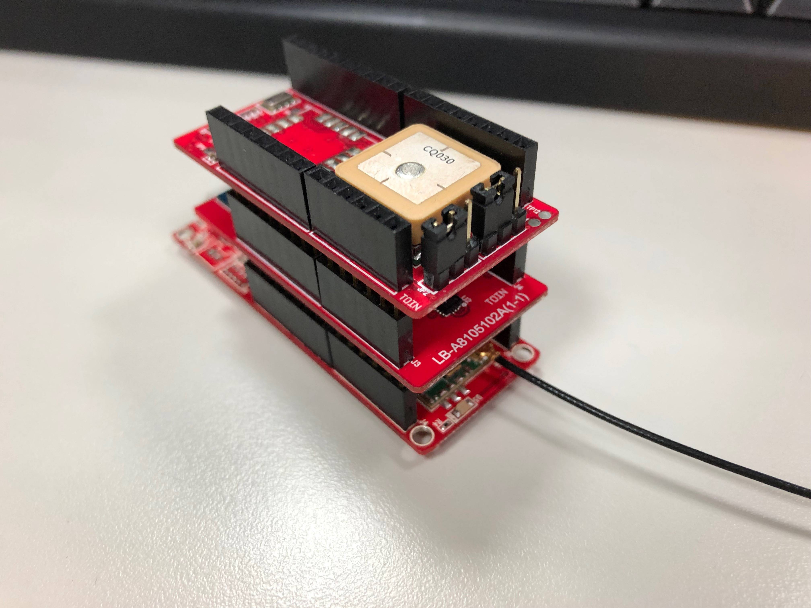
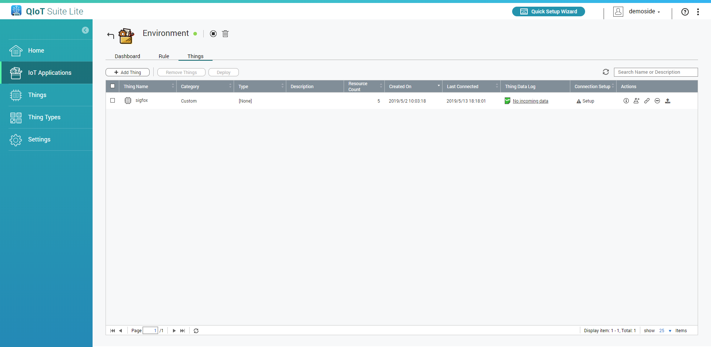
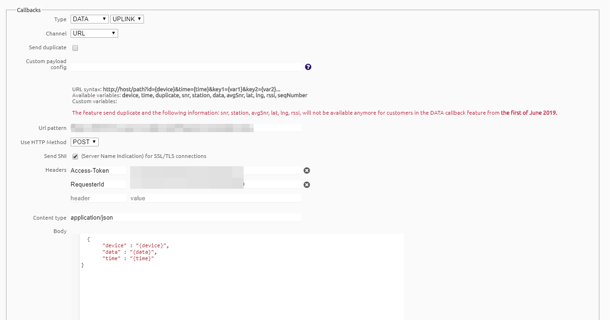
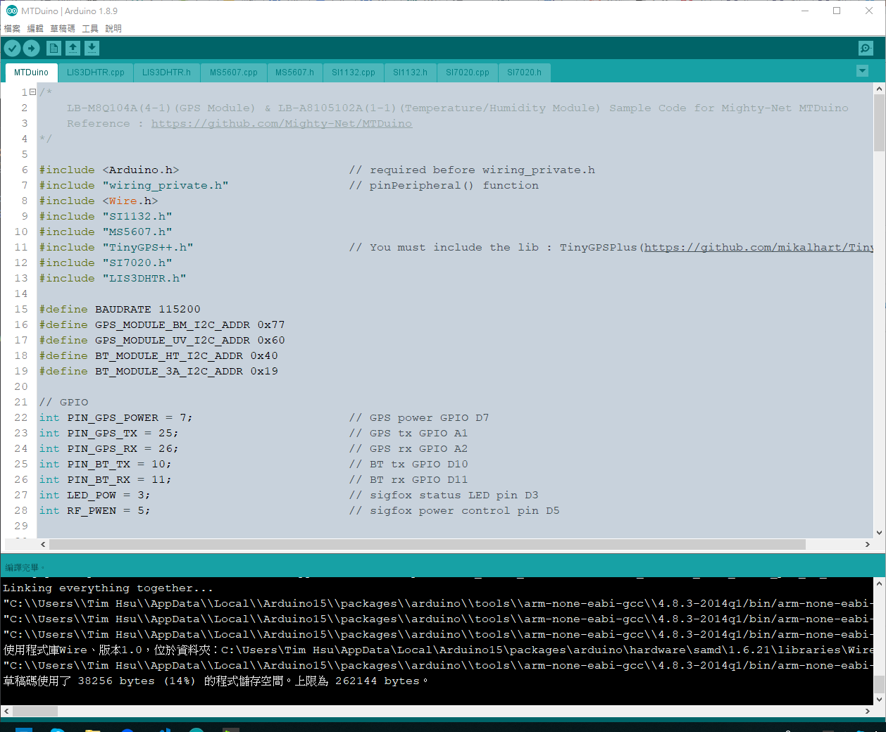
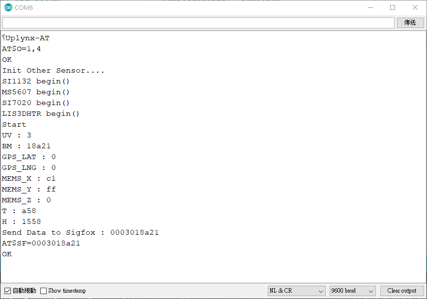
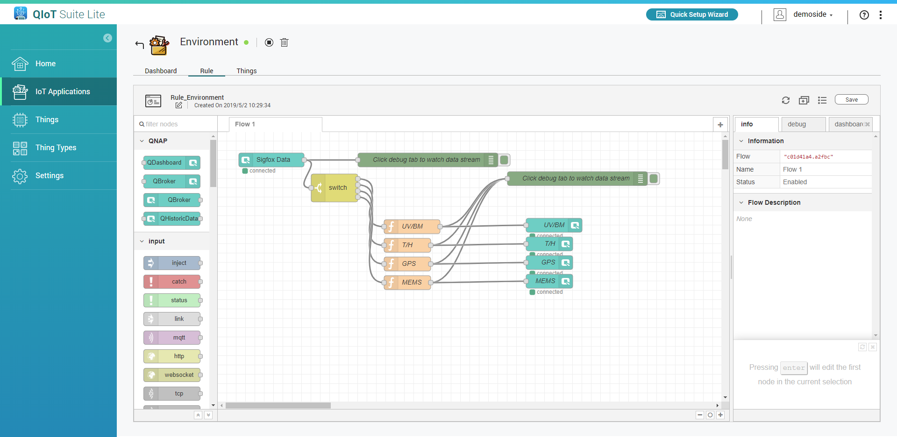
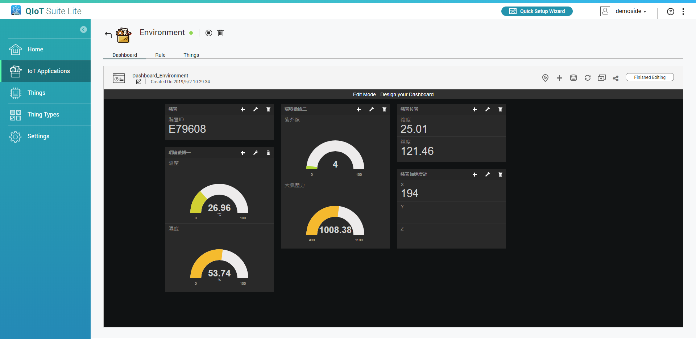

# MTDuino(have SigFox module) & QNAP QIoT Suite

## 事前準備

* **MTDuino-SFM2CWWW001 SigFox開發版** - 
    產品資訊及購買請參考 : 
    * https://www.icshop.com.tw/product_info.php/products_id/27071
    * https://partners.sigfox.com/products/mtduino-sfm2cww001
    * https://might.com.tw/zh-TW
* **Mighty-Net LB-M8Q104A(4-1) & LB-A8105102A(1-1)擴充版**
    
* **已安裝QIoT Suite Lite的QNAP NAS**
* **SigFox後臺帳號** 

## MTDuino前期設定及開通
MTDuino前期設定及開通請參考此篇文章 : [**MTDuino—專門替 Sigfox 打造的 Arduino**](https://makerpro.cc/2019/02/mtduino-as-an-arduino-and-sigfox-connectivity-module/)

## QIoT Suite 匯入範例專案檔
參考QIoT Suite使用手冊匯入[**[QIoT/Environment.json]**](./QIoT/Environment.json)範例檔案

## 設定SigFox Callback連接QIoT Suite
設定SigFox Callback連接QIoT Suite參考此篇文章 : [**如何在QIoT Suite Lite中接收Sigfox訊息**](https://qiot.qnap.com/blog/2018/01/31/%E5%A6%82%E4%BD%95%E5%9C%A8qiot-suite-lite%E4%B8%AD%E6%8E%A5%E6%94%B6sigfox%E8%A8%8A%E6%81%AF/)

## MTDuino燒錄
範例檔案 : [**[MTDuino.ino]**](./MTDuino/MTDuino.ino)
開發版請選擇 **"Arduino M0 Pro (Native USB Port)"** 並進行燒錄

(注意 : 因為SigFox單次最多傳 12 byte，故數值皆轉成16進位模式並且分組傳送，每組傳送間隔約30秒，全部傳送完間隔10分鐘後傳送下次訊息，有浮點數數值皆取小數點後兩位並乘與100，接收後在QIoT Suite Lite Rule中做轉換，詳細請參考Code)

## 完成圖

